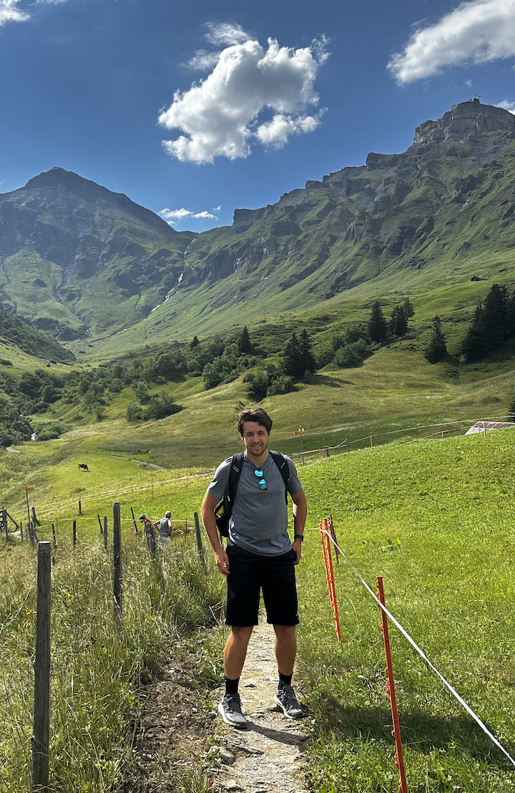

My name is **Benny Rubin**. 

The best way to contact me is by email: bennycrubin (at) gmail.com 

<!---

and here
-->

### Travel
- I enjoy backpacking and exploring new cities
- My favorite places I have hiked are Yosemite, Zion, and the Swiss Alps

<iframe src="https://www.google.com/maps/d/u/1/embed?mid=1TK3uk4m97Zq-C4Kbw7NVGUfRijBB0QA&ehbc=2E312F&noprof=1" width="640" height="480"></iframe>

### Cooking
- I love to cook vegetarian food and try new recipes! Lately I have been experimenting with a lot of Indian cuisine

### Reading
- I enjoy reading many genres of books including philosophy, history, novels, and sci-fi
- My favorite books are The Unbearable lightness of Being, The 3 Body Problem, and A Gentleman In Moscow

### Sports
- I have been playing soccer my whole life. Since quitting playing competitively in high school, I play pickup with my friends and intramural at Cornell 
- I run to keep in shape for soccer, but have - to my surprise - grown to really enjoy it! I am currently training for my first marathon 
- In the summer, I wakeboard on the Severn River in Maryland

### Music
- I love listening to all genres of music. I grew up playing classical piano, but my current instrument of choice is the ukelele.

